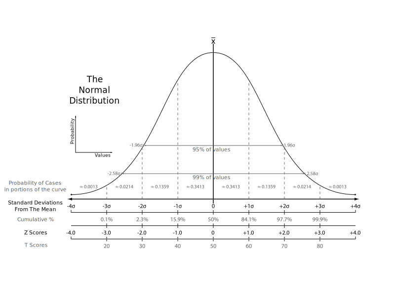

## Hvad er en sandsynlighedsfordeling?

:::: {.columns}

:::: {.column}
Når vi måler noget får vi som regel en række forskellige resultater. 

Højde af mænd er et eksempel. Nogen er 1,85 meter. Andre 1,80 meter.

Når vi laver et histogram af alle de målinger, kunne det se således ud:
::::
:::: {.column}
```{r hist-male-height, echo = FALSE}
rnorm(1000, mean = 181, sd = 6.5) |> hist(main = "Fordelingen af danske mænds højde", xlab = NULL)
```

Hvad er mest sandsynligt - at være mellem 190 og 195 cm eller at være mellem 180 og 185 cm høj?
::::

::::


## Hvad er en sandsynlighedsfordeling?
En sandsynlighedsfordeling beskriver hvordan vores målinger fordeler sig.

- Hvad er sandsynligheden for at se en observation der ligger under en bestemt værdi?
- Hvad er sandsynligheden for at se en observation der ligger over en bestemt værdi?
- Hvad er sandsynligheden for at se en observation der ligger mellem to forskellige værdier?
- I hvilket interval finder vi en bestemt andel af observationerne?

## Hvordan kan vi beskrive alle de her observationer?

```{r}
rnorm(50, mean = 181, sd = 6.5) |> round(digits = 1)
```

. . . 

Gennemsnit

. . . 

Standardafvigelse

:::: notes
Vi vil gerne have dem til at sige middelværdi. Og standardafvigelse
::::

## Middelværdi og standardafvigelse

$x$ er vores målinger. $x_i$ er en fancy måde at skrive at der er flere:
$x_1, x_2, x_3, ... x_i$. og vi har ialt $N$ observationer

Middelværdien:
$$\mu = \frac{\sum{x_i}}{N}$$

Standardafvigelsen

$$\sigma = \sqrt{\frac{\sum(x_i - \mu)^2}{N}  }$$

:::: notes

Vi kan forstå standardafvigelsen som den gennemsnitlige forskel der er mellem observationerne og middelværdien.

Hvorfor kvadrerer vi? Forskellen kan være positiv eller negativ. Det betyder at når vi lægger dem sammen, kan resultatet blive 0. Også selvom forskellene faktisk er ret store. Så vi kvadrerer dem. og tager kvadratroden 
bagefter. Det betyder også at store afvigelser fra middelværdien "fylder" mere i standardafvigelsen.

::::

## Hvornår bruger vi græske bogstaver?

:::: notes
Læg mærke til at vi undertiden bruger græske bogstaver.

Kender vi den sande værdi af gennemsnittet af alle danske mænds højde? Normalt ikke.

::::

Det gør vi når vi kender de "sande" værdier:

Middelværdi: $\mu$. Standardafvigelse: $\sigma$

De latinske bogstaver bruger vi når vi "kun" kender værdierne fra vores stikprøve:

Middelværdi: $\bar{x}$. Standardafvigelse: $s$


## Hvad er normalfordelingen?

Værdierne vi så før var normalfordelte

De fleste eksamensopgaver I støder på, har en formulering om at I kan antage at data er normalfordelte.

Hvad betyder det?

. . .

Undersøger vi hvilken sandsynlighedsfordelinger mange forskellige ting følger

. . . 

Så er der en bestemt sandsynlighedsfordeling der optræder flere gange end andre.

. . . 

Det er den "normale" fordeling

:::: notes
Det er ikke en normativ betegnelse, normal i denne kontekst blot den hyppigst forekommende

::::

## Hvordan ser den ud?

Observationer der er normalfordelte, følger denne fordeling:

$$
f(x) = \frac{1}{\sqrt{2\pi\sigma^2}} e^{-\frac{(x-\mu)^2}{2\sigma^2}}
$$


$f(x)$ er sandsynligheden for at se en observation med værdien x. $\mu$ og $\sigma$ har vi mødt før.

. . . 
 
Det er der jo ingen der orker at arbejde med...

. . . 

Det vigtige er at den 100% styres af $\mu$ og $\sigma$

## Hvordan ser den ud?

```{r normalfordelingen, echo = FALSE}
library(tidyverse)
x <- seq(-4, 4, length.out = 100)

# Normal fordeling
normal <- dnorm(x, mean = 0, sd = 1)
tibble(x = x, y = normal) |> 
  ggplot(aes(x, y = normal)) +
  geom_line()
```

- Her har vi målinger der kan gå fra -4 til 4. 
- Og har $\mu = 0$ og $\sigma = 1$. 
- Arealet under kurven er 1 ~ 100%.
- For alle værdierne er med og sandsynligheden for at vi ser en værdi er 100%

## Standardnormalfordelingen

Når $\mu = 0$ og $\sigma = 1$ kalder vi den for "standardnormalfordelingen".

Den skriver vi som: $N(1,0)$

. . . 

Andre normale fordelinger findes

. . . 

Dem skriver vi som $X \sim N(\mu,\sigma)$

. . . 

De kan omregnes (skaleres) til standardnormalfordelingen

. . . 

Det kommer vi til at øve!


:::: notes
Det at kunne skalere til og fra standardnormalfordelingen er dels nyttigt for at kunne løse opgaverne. Det tester om I har forstået hvad der foregår,
og det er ret vigtigt.

Det handler også om at i gamle dage havde vi ikke programmer der kunne lave beregningerne for en hvilken som helst normalfordeling. Så matematikere sad
møjsommeligt og beregnede værdier for standardnormalfordelingen. Og så kunne man slå op i tabeller.
::::


## Hvilke egenskaber har den?



:::: notes

Bemærk at enheden på x-aksen er i "standardafvigelser". 
At den går fra minus uendelig til uendelig
sammenhængen mellem median og middelværdi
Læg også mærke til at z-scores er lig med enheden. T-scores er en normalisering fra psykometrien. Den bruger vi ikke her.

::::

## Et par hurtige øvelser
Hvis vores observationer er normalfordelte med $\mu = 0$ og $\sigma = 1$

- Hvor mange observationer er mindre end 1 ($\sigma$)?  <span class="fragment">84.1%</span>

. . . 

- Hvor mange observationer er mindre end -2 ($\sigma$)? <span class="fragment"> 2.3%</span>

. . . 

- For hvilken værdi (af $\sigma$) er 15.9% af observationerne mindre (end denne værdi)? <span class="fragment"> -1 ($\sigma$) </span>


## Fine tal - hvordan finder vi dem selv?

Ifølge den fine graf ligger 15.9% af observationerne under $-1\sigma$. 

Hvordan finder vi selv det tal?

- pnorm
- qnorm


## pnorm

pnorm(x) fortæller hvad sandsynligheden p er for at se en observation der er mindre end x.

```{r echo = TRUE}
pnorm(-1)
```

Vi kan også skrive det som:

P(X < -1) = 0.1586553

. . . 

Læses: Sandsynligheden (P) for at værdien (X) er mindre end -1 er 0.158osv

Vi taler også om at det er 15.8 kvantilen, eller 15.8 percentilen.

## Og omvendt?

Hvis sandsynligheden for at at X er mindre end -1 skrives som:

P(X < -1)

Hvad er så sandsynligheden for at X er større end -1?

. . . 

1 - P(X < -1)

X er enten mindre end 1. Eller større end 1. Den samlede sansynlighed for at X _er_ er 1.

## qnorm

qnorm(p) fortæller os den værdi x, hvor sandsynligheden for at være mindre end x er p. 

```{r echo = TRUE}
qnorm(0.025)
```

For hvilken værdi er 0.025 eller 2.5% af observationerne mindre?

Det kalder vi også for 2.5 percentilen. Eller 2.5% kvantilen. På engelsk quantile. Deraf "q".

## Eller

- pnorm går fra kvantil til sandsynlighed.
- qnorm går fra sandsynlighed til kvantil.

P(X < værdi) = sandsynlighed

- Hvis vi ved hvad værdien er, bruger vi pnorm til at beregne sandsynligheden
- Hvis vi ved hvad sandsynligheden er, bruger vi qnorm til at beregne værdien

## Typiske spørgsmål (v)i får:
(til eksamen)

1. Hvor mange procent af observationerne er under 0.4?
2. Hvor mange procent af observationerne ligger mellem -2 og 2?
3. De 65.5% mindste observationer; hvad er de mindre end?
4. Indenfor hvilket interval ligger 95.45% af observationerne?

:::: notes
De hænger sammen. 1 og 3 er hinandens omvendte
2 og 4 er også hinandens omvendte

:::: 


## Øvelse 1

:::: {.columns}
:::: {.column}
Hvilken andel af observationerne i standardnormalfordelingen er mindre end -3?

::::notes
Det er en sandsynlighed vi er på jagt efter  så pnorm. pnorm(-3) for at være mere præcis.
::::

::::
:::: {.column}
```{webr-r}
#| context: interactive
#| layout: horizontal
#| autorun: false

```
::::
::::


## Øvelse 2

:::: {.columns}
:::: {.column}
Hvilken andel af observationerne i standardnormalfordelingen er mindre end 2?

::::notes
Det er en sandsynlighed vi er på jagt efter så pnorm
::::

::::
:::: {.column}
```{webr-r}
#| context: interactive
#| layout: horizontal
#| autorun: false

```
::::
::::


## Øvelse 3

:::: {.columns}
:::: {.column}
Hvilken andel af observationerne i standardnormalfordelingen er større end 2?

::::notes
Det er en sandsynlighed vi er på jagt efter så pnorm. Den giver os sandsynligheden for at 
observationerne er mindre end 2. Sandsynligheden for at observationen er, er 1. Så 1-pnorm(2)
::::

::::
:::: {.column}
```{webr-r}
#| context: interactive
#| layout: horizontal
#| autorun: false

```
::::
::::

## Øvelse 4

:::: {.columns}
:::: {.column}
Hvad er 25% af observationerne mindre end?

::::notes
Nu kender vi sandsynligheden, og skal have værdien - qnorm. Mere præcist qnorm(0.25)
::::

::::
:::: {.column}
```{webr-r}
#| context: interactive
#| layout: horizontal
#| autorun: false

```
::::
::::


## Øvelse 5

:::: {.columns}
:::: {.column}
Hvad er 40% af observationerne større end?

::::notes
Det svarer til den værdi hvor 60% af observationerne er mindre. så qnorm, men af 0.6. Så: qnorm(1-0.4) eller qnorm(0.6)
::::

::::
:::: {.column}
```{webr-r}
#| context: interactive
#| layout: horizontal
#| autorun: false

```
::::
::::


## Øvelse 6

:::: {.columns}
:::: {.column}
Hvilken andel af observationerne ligger mellem 1 og 1.5?

::::notes
Vi kender værdierne, og skal bruge sandsynlighederne. Så pnorm.
Sandsynligheden er arealet under kurven fra -uendelig til værdien. Så. Arealet fra -uendelig til 1.5. Minus arealet fra -uendelig til 1, trukket fra, giver os arealet mellem de to punkter
::::

::::
:::: {.column}
```{webr-r}
#| context: interactive
#| layout: horizontal
#| autorun: false

```
::::
::::


## Øvelse 7

:::: {.columns}
:::: {.column}

Hvis vi vil have 47% af observationerne, hvilket interval (centreret om 0) skal vi så have?

::::notes
Det der ligger uden for de 47% er 1 - 0.47 = 0.53. 
Det ligger symmetrisk, så halvdelen på den ene side og den anden halvdel på den anden.

0.53/2 = 0.265 

Vi kender sandsynligheden, så vi skal bruge qnorm for at finde værdien. qnorm(0.265)

Og er er lige mange på hver side, så det giver os den nedre, den øvre er samme absolutte værdi. 

::::

::::
:::: {.column}
```{webr-r}
#| context: interactive
#| layout: horizontal
#| autorun: false

```
::::
::::

## Øvelse 8 - og det vigtigste tal I skal kende!


:::: {.columns}
:::: {.column}

Hvis vi vil have 95% af observationerne, hvilket interval (centreret om 0) skal vi så have?

::::notes
Det der ligger uden for de 95% er 1 - 0.95 = 0.05. 
Det ligger symmetrisk, så halvdelen på den ene side og den anden halvdel på den anden.

0.05/2 = 0.025

Vi kender sandsynligheden, så vi skal bruge qnorm for at finde værdien

Og er er lige mange på hver side, så det giver os den nedre, den øvre er samme absolutte værdi.

::::

::::
:::: {.column}
```{webr-r}
#| context: interactive
#| layout: horizontal
#| autorun: false

```
::::
::::


## Gennemsnitshøjden er jo ikke 0?!

Eksamensopgaver omhandler i almindelighed normalfordelte data.

Så kan beregningerne lettere laves.

Og man tester om I har forstået normalfordelingen.

Men middelværdier er sjældent 0. Og standardafvigelser ligeså sjældent 1.

Hvis bare der var en måde at transformere data til at have $\mu = 0$ og $\sigma =1$.

. . . 

Det er der. 

## Skalering af data - gennemsnittet

Hvad er gennemsnittet af tallene 1 til 6?

. . . 

```{r echo  = TRUE}
mean(1:6)
```

. . . 
 
Hvad er gennemsnittet af tallene 1 til 6, efter vi har trukket 3.5 fra?

. . . 

```{r echo = TRUE}
mean(1:6 - 3.5)
```

## Skalering af data - standardafvigelse?

Hvad standardafvigelse af tallene fra 1 til 6?

. . . 

```{r echo = TRUE}
sd(1:6)
```

. . . 

Hvad er standardafvigelsen af tallene 1 til 6 hvis vi dividerer dem med standardafvigelsen?

. . . 

```{r echo = TRUE}
sd(1:6/sd(1:6))
```

. . . 

Magi... eller "bare" matematik.

:::: notes
Vi kan godt udlede hvorfor det passer. Nu nøjes vi bare med at konstatere at det gør det.
::::

## Skalering af data - begge parametre

Nu med tallene 1 til 9

```{webr-r}
#| context: interactive
#| layout: horizontal
#| autorun: false

```


## Hvad kan vi bruge det til?

Hvis $\mu$ er 181 og $\sigma$ er 6.5

og vi vil vide hvad sandsynligheden er for at være mindre end 170 cm høj.

Det kan vi skrive som:

P(X<170)

Skalerer vi X, skal vi også skalere 170:

$P(X<170) = P(\frac{X-\mu}{\sigma} < \frac{170 - 181}{6.5}) = -1.692$

```{r echo = TRUE}
pnorm(-1.692)
```


## Notation

Den standardiserede normalfordeling skriver vi som N(0,1)
En normalfordeling (der ikke er standardiseret) skriver vi som $N(\mu, \sigma)$
Når vi har data, X, der er normalfordelt, skriver vi det som X ~ $N(\mu, \sigma)$

Eller: P(X < 170) = P($\frac{X-\mu}{\sigma}$ < $\frac{170-\mu}{\sigma}$)

Det gider vi ikke skrive, så i stedet skriver vi Z: P(Z < $\frac{170-\mu}{\sigma}$)

Lagde I mærke til Z på plottet af normalfordelingen? 
Ikke alene normaliserer vi X til at have en bestemt middelværdi, vi måler den også i enheder af 
standardafvigelsen. Den z-score vi så på grafen. Det er det Z. 


## Og den anden vej

Så undertiden beregner vi Z. Og så skal vi bagefter finde ud af hvad X er. 

Hvis vi ved hvordan vi går fra X til Z, så ved vi også hvordan vi går fra Z til X.

. . . 

En ene vej trækker vi $\mu$ fra og dividerer med $\sigma$

. . . 

Den anden vej? 

. . . 

Ganger med $\sigma$ og lægger $\mu$ til


## Øvelser

For en normalfordelt population ved vi at 50% af værdierne er mindre end 0, og 60% er mindre
end 1. Hvad er middelværdi og spredning?

. . . 

Det kan vi skrive som: 
 
- P(X<0) = 0.5
- P(X<1) = 0.6


## Øvelser

Vi antager at X ~N(mu, sigma)

Skaler til standardnormalfordelingen:

$P(\frac{X-\mu}{\sigma} < \frac{0-\mu}{\sigma})  = 0.5$

$P(\frac{X-\mu}{\sigma} < \frac{1-\mu}{\sigma})  = 0.6$

Husk at når vi kender sandsynligheden for en ukendt værdi, kan vi bruge qnorm til at beregne den ukendte værdi.

dvs.

$\frac{0-\mu}{\sigma}  = qnorm(0.5)$ og

$\frac{1-\mu}{\sigma}  = qnorm(0.6)$

## Øvelser

```{r echo = TRUE}
qnorm(0.5)
```

```{r echo = TRUE}
qnorm(0.6)
```

så:

$\frac{0-\mu}{\sigma}  = 0$

$\frac{1-\mu}{\sigma}  = 0.25$

Løs først den ene ligning, og så den anden


## Øvelser

$\frac{0-\mu}{\sigma}  = 0 \Leftrightarrow 0 - \mu = 0\sigma \Leftrightarrow 0-0\sigma = \mu \Leftrightarrow \mu = 0$

Indsæt i anden ligning:

$\frac{1-\mu}{\sigma}  = 0.25 \Leftrightarrow \frac{1-0}{\sigma} = 0.25 \Leftrightarrow 1 = 0.25\sigma \Leftrightarrow \frac{1}{0.25} = \sigma = 4$

Smutvej: Hvis 50% af observationerne er mindre end 0, betyder det at 0 er medianen. I en normalfordeling er medianen lig middelværdien. Så vi ved meget hurtigt at $\mu = 0$

## Endnu en øvelse

For en population af normalfordelte værdier ved vi at 40% af værdierne er større end 0.1, og 70% af værdierne 
er mindre end 1. Hvad er middelværdi og spredning i denne normalfordeling?

```{webr-r}
#| context: interactive
#| layout: horizontal
#| autorun: false


```

:::: notes


::::

## Løsning

:::{style="font-size: .4em;"}
Det er oplyst at $X\sim N(\mu,\sigma)$

$P(X>0.1) = 0.4 \Leftrightarrow P(X<0.1) = 1-0.4 = 0.6$

Standardiseret:

$P(\frac{X-\mu}{\sigma}<\frac{0.1-\mu}{\sigma}) = 0.6 \Rightarrow \frac{0.1-\mu}{\sigma} = qnorm(0.6) = 0.253$

Og:
 
$P(X<1) = 0.7$

Standardiseret:

$P(\frac{X-\mu}{\sigma}<\frac{1-\mu}{\sigma}) = 0.7 \Rightarrow \frac{1-\mu}{\sigma} = qnorm(0.7) = 0.524$

Dermed:

$\frac{0.1-\mu}{\sigma} = 0.253 \Leftrightarrow 0.1-\mu = 0.253\sigma$ 

og 

$\frac{1-\mu}{\sigma} = 0.524 \Leftrightarrow 1-\mu = 0.524\sigma$

Træk første ligning fra den anden og isoler $\sigma$:

$(1 - \mu) - (0.1 - \mu) = 0.524\sigma - 0.253\sigma \Leftrightarrow 1 - \mu - 0.1 + \mu = (0.524-0.253)\sigma$

$1-0.1 = 0.271\sigma \Leftrightarrow \frac{0.9}{0.271} = \sigma = 3.32$

Indsæt i en af ligningerne for at finde $\mu$:

$1-\mu = 0.524\sigma \Leftrightarrow 1 - \mu = 0.534\cdot3.32 \Leftrightarrow 1 - 0.534\cdot3.32 = \mu = -0.77$

::::

## Hvorfor er den vigtig?

På grund af "Den Centrale Grænseværdisætning".

Vi er interesseret i gennemsnitshøjden af danske mænd. Vi ved ikke hvilken sandsynlighedsfordeling der beskriver danske mænds højde.

Så vi tager en stikprøve på eksempelvis 20 mænd fra populationen (alle danske mænd) og måler deres højde.

Vi beregner gennemsnittet af den stikprøve og gemmer det.

Det gentager vi mange gange. Ny stikprøve - mål - beregn gennemsnit. Ny stikprøve - mål - beregn gennemsnit.

## Hvorfor er den vigtig?

Det gør vi mange gange. 

. . . 

Det giver en masse gennemsnit/middelværdier.

. . . 

De middelværdier vil følge normalfordelngen. 

_Uanset_ hvilken sandsynlighedsfordeling danske mænds højde følger.

Det kan man føre bevis for. Hvis I kan forstå det bevis, skulle I have læst matematik i stedet for medicin. Så det springer vi over.
 
## En gang til

Hvis vi tager mange stikprøver, og beregner deres middelværdier. Så vil de middelværdier følge normalfordelingen.

Bemærk at vi ikke kender disse middelværdiers spredning. Det kommer vi til.


## Hvorfor er den vigtig for jer?

Ret ofte er der en typeopgave der grundlæggende tester om I forstår normalfordelingen. 

Det er sådan nogen vi har været igennem. 

Og så bruges den i de statistiske tests. Det kommer vi også til.


## Logaritmering

Ud over skalering af data er der en anden skalering eller transformation vi ofte foretager - logaritmering.

Ting der ikke er normalfordelte bliver det ofte hvis man tager logaritmen til dem.


## Øvelse

:::: {.columns}
:::: {.column}
Vi har en normalfordelt population med $\sigma = 6.52$. 40% af værdierne er mindre end 0. 
Hvad er så $\mu$ for denne fordeling?

::: {.fragment}
$X \sim N(\mu, 6.52)$
:::
::: {.fragment}
P(X<0) = 0.4
::::
::: {.fragment}
Skaler:
$P(Z < \frac{0-\mu}{6.52}) = 0.4$
::::
::: {.fragment}
$\frac{0-\mu}{6.52} = qnorm(0.4) = -0.2533471$
Isoler $\mu$
::::


::::
:::: {.column}

```{webr-r}
#| context: interactive
#| layout: horizontal
#| autorun: false

```

::::
::::

## Øvelse - Manglende procentil:

:::: {.columns}
:::: {.column}
En normalfordelt population har middelværdi $\mu = 12.5$ og 
standardafvigelse $\sigma = 3.2$. Hvor stor en andel af værdierne 
er mindre end 10?

Med andre ord, hvad er:

$P(X < 10)$


Transformer til standardnormalfordelingen:

$P(Z < \frac{10 - \mu}{\sigma})$


::::
:::: {.column}
```{webr-r}
#| context: interactive
#| layout: horizontal
#| autorun: false

```

::::
::::

::::notes

pnorm((10-12.5)/3.2)

::::


## Øvelse - Manglende $\sigma$
:::: {.columns}
:::: {.column}
I en normalfordelt population er $\mu = 85$ og 25% af værdierne er større end 95. Hvad er $\sigma$ for denne fordeling?

::: {.fragment}
P(X > 95) = 0.25
:::
::: {.fragment}
P(X<95) = 1-0.25 = 0.75
:::

::: {.fragment}
$P(Z< \frac{95-\mu}{\sigma}) = 0.75$
:::

::: {.fragment}
$(95-85)/\sigma = qnorm(0.75)$
:::

::: {.fragment}
$10/qnorm(0.75) = \sigma$ 
::::


::::
:::: {.column}
```{webr-r}
#| context: interactive
#| layout: horizontal
#| autorun: false

```

::::
::::


## Manglende værdi, kendt procentil:
:::: {.columns}
:::: {.column}
En normalfordelt variabel har $\mu = 50$ og 
$\sigma = 8$. For hvilken værdi y er 90% af observationerne < y?

::: {.fragment}
Find 90%-kvantilen for X ~ N(50,8)
::::

::: {.fragment}
 $P(Z< \frac{y-\mu}{\sigma}) = 0.9$
::::

::: {.fragment}
$P(Z< \frac{y-50}{8}) = 0.9$
::::

::: {.fragment}
qnorm(0.9) = 1.2816
$\frac{y-50}{8} = 1.2816$, isoler y     
::::


::::
:::: {.column}

```{webr-r}
#| context: interactive
#| layout: horizontal
#| autorun: false

```

::::
::::

## Manglende middelværdi (variant 2):
:::: {.columns}
:::: {.column}
For en normalfordeling gælder det at $\sigma = 4.5$ og 75% af 
værdierne er > 18. Hvad er $\mu$?

::: {.fragment}
P(X>18) = 0.75
:::

::: {.fragment}
P(X<18) = 1 - 0.75 = 0.25
:::

::: {.fragment}
Standardiser:
$P(Z < \frac{18-\mu}{\sigma}) = 0.25$
:::

::: {.fragment}
$\frac{18-\mu}{\sigma} = qnorm(.25) = -0.6744898$
Indsæt $\sigma = 4.5$ og isoler $\mu$
:::

::::
:::: {.column}

```{webr-r}
#| context: interactive
#| layout: horizontal
#| autorun: false
```

::::
::::

## Manglende interval-grænse

:::: {.columns}
:::: {.column}
En normalfordelt population har $\mu = 100$ og $\sigma = 15$. 
Hvis 80% af værdierne ligger mellem 85 og en øvre grænse $x$, 
hvad er da denne øvre grænse?

eller find z således at: P(85 < X < x) = 0.8

1 - 0.8 = 0.2 ligger udenfor intervallet
Hvilken andel ligger under 85?

P(X<85) = 0.8
$P(Z< \frac{85-\mu}{\sigma}) = 0.8$ 
$\frac{85-\mu}{\sigma} = qnorm(0.8)$
0.2 - denne andel skal ligge over.


Vi leder efter et interval. Det starter ved 85. Vi skal finde ud af hvad den øvre grænse er.
100-80 = 20% ligger uden for intervallet.
Hvor mange af værdierne ligger under 85? 
20% minus denne værdi skal ligge over den øvre grænse vi leder efter.

P(X<85)
X < (85-100)/15

```{r}
qnorm(1 - (0.2- pnorm(-1)))*15+100
```
::::
:::: {.column}
```{webr-r}
#| context: interactive
#| layout: horizontal
#| autorun: false
```
::::
::::

## Normalområdet

Populært spørgsmål - hvad er normalområdet for "noget"?

Hvis de 95% hyppigste observationer i en normalfordelt population er "normalområdet". 
I hvilket interval ligger de de så?

. . . 

Hvis de er centreret om en middelværdi, så ligger 100% - 95% udenfor

. . . 

Så 2.5% ligger lavere, og 2.5% ligger højere.

. . .

Kender vi middelværdi og standardafvigelse kan vi beregne intervallet i hvilket 95% af observationerne ligger

## Normalområdet - øvelse 

Hvis middelværdi for serum-kolesterol er 200 mg/dL og standardafgivelsen er 40 mg/dL, hvad er så normalområdet? Defineret som det interval i hvilket 95% af værdierne vil ligge?

## Normalområdet - nedre grænse

$X \sim N(200, 40)$

Nedre grænse så de (100-95)/2 = 2.5% laveste værdier

P(X < y) = 0.025

Standardiser:

P(Z < \frac{y-200}{40}) = 0.025

y-200/40 = qnorm(0.025) = - 1.959964

Isoler y:
-1.959964*40 + 200 = 122


:::: notes
Der er en del domænespecifikke ting der spiller ind her. 
::::

## Normalområdet - øvre grænse

Den øvre grænse er så den grænse under hvilken de 95% i normalområdet _og_ de 2.5% under normalområdet ligger.

Dvs. 

P(X < y) = 0.95+0.025 = P(X < y) = 0.975

Standardiser:

P(Z < y - 200 / 40 ) = 0.975

y - 200 / 40 = qnomr(0.975) = 1.959964

Isoler y:

y = 1.959964 * 40 + 200 = 278


## Normalområde - fra en eksamensopgave
Vi får oplyst "summariske regnestørrelser" for plasma magnesium for diabetikere. Vi får lov at antage at 
plasma magnesium er normalfordelt for de to populationer stikprøverne er trukket:
```{r}
tribble(~gruppe, ~Antal, ~Gennemsnit, ~Sprdening,
"Diabetikere", 227, 0.719, 0.068,
"Ikke-diabetikere", 140, 0.810, 0.057)
```

Beregn et interval, der indeholder 95% af plasma magnesium målingerne for kontrol populationen (ikke-diabetikere)

middelværdi +/- 1.96*spredning

0.70 - 0.92

## Normalområde - fra en eksamensopgave

hvor stor en andel af plasma magnesium målingerne i populationen af diabetikere vil ligge i det interval vi beregnede for ikke-diabetikerne?

X ~ N(0.719, 0.068)

Eller - hvor mange ligger over værdien 0.7. og hvor mange ligger under 0.92?

Eller: P(0.7 < X < 0.92)

eller: 
P(X < 0.92) - P(X < 0.7)

Standardiser:

P(Z < 0.92-mu / sd) - P(Z < 0.7 - mu / sd)

mu 0.719, sigma 0.068

```{r}
pnorm((0.92-0.719)/0.068) - pnorm((0.7-0.719)/0.068)
```

JEG SKAL NOK HAVE NOGET MED FOR DENNE MÅDE AT BEHANDLE INTERVALLERNE!

## Normalområde - cowboy trick

1.96 er det magiske tal. Så det er overflødigt at lave standardiseringen.

gå direkte til middelværdi +/- 1.96*sd

eller

200 + c(-1,1)* 1.96 * 40


## Cowboy trick 2 

Hvor stor en andel af observationerne er mindre end 50 når middelværdien er 47 og standardafvigelsen er 42?

Vi kan skalere de 50, og putte resultatet ind i pnorm.

```{r echo = TRUE}
pnorm((50-47)/42)
```

Eller, vi kan lade R gøre det for os:

::: {.fragment}

```{r echo = TRUE}
pnorm(50, mean = 47, sd = 42)
```

:::

::: {.fragment}
For de typeopgaver hvor vi skal finde $\mu$ og/eller $\sigma$ hjælper det ikke. Eksamenstaktisk er det nok også bedre at skalere manuelt (det demonstrerer at I har forstået teknikken; det er det de tester). Men så har I en kontrol på om I har regnet rigtigt.
:::


